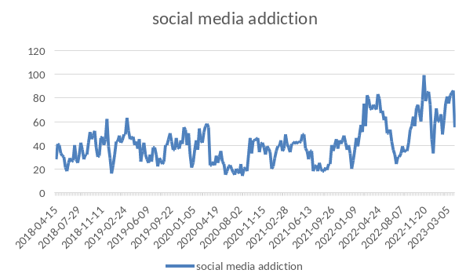

\newpage
## Table of Contents

- [Part I - List of Opportunities](#part-i---list-of-opportunities)
  - [Sources of Inspration](#sources-of-inspiration)
  - [Immersion](#immersion)
  - [List of Problems](#list-of-problems)
- [Part II - Statement, Evaluation and Selection of the Inspirational Problem](#part-ii---statement-evaluation-and-selection-of-the-inspirational-problem)
  - [Evaluation](#evaluation)
  - [Selection](#selection)

\newpage
## Part I - List of Opportunities

### Sources of Inspiration

|  -  | **Area** | **Scope** | **Reason** |
| :-: | :------: | :-------: | :--------: |
| **Macro Trends** | Technological acceleration | Social media and smartphone addiction, especially among the young | The excessive use of these technologies is doing more harm than good, further isolating and dividing the population |
| **Sectors of Activity** | *Emerging*: social innovation, Industry 4.0. *Traditional*: Welfare, Elecrtronics | Smart devices, social networking apps | Industry 4.0 is helping mankind solve many problems, but there is a growing concern that we are becoming more and more addicted to some of the benefits they offer, especially through the advancements in smartphones and software |
| **Technologies** | AI, Big Data, VR/AR | Algorightms and data collection involved in recommendations and ads in social media | As Machine Learning and similar technologies evolve, these social media apps make users stay for longer periods of time, thus damaging slowly their mental health and wellbeing |

### Immersion

#### Sources of information used

*Specialized websites of the Business world*

Here are a list of websites related to the area of enterpreneurship and business going over similar ideas as I have previously mentioned:

- [Our Social Media Addiction](https://hbr.org/2022/11/our-social-media-addiction)
- [How to stop the mindless scrolling](https://www.businessinsider.com/cure-screen-time-social-media-phone-addiction-app-one-sec-2023-3)
- [Digital Minimalism](https://www.chibus.com/lifestyle/2021/12/5/digital-minimalism)
- [Digital Minimalism: The Future of Work](https://www.senstone.io/digital-minimalism-the-future-of-work)
- [Science Explains Why You're Addicted to Social Media -- and How to Break That Addiction](https://www.entrepreneur.com/science-technology/science-explains-why-youre-addicted-to-social-media-and/298929)

*Clusters*

There are two related clusters to the topic I am willing to develop an enterpreneurship project in:

- [Clúster Digital of Catalunya](https://www.clusterdigital.cat/?lang=en)
- [Clúster Salut Mental](https://www.clustersalutmental.com/#1623670899801-3738afbe-d258)

*Google Trends*

The data offered by Google searches that people seem to be more and more concerned with their relationship with technology,
as shown by these graphs:

#### Key Questions

1. **How is this area?** *It is a big concern for many, but not many business are paying attention to this*
1. **In which fields is the scope structured?** *The fields are Social Welfare, Mental Health, ICT and AI/ML*
1. **What are the main players in this field?** *Big Tech companies, Governments and families all play a big role in the area of smartphone and social media addiction*
1. **What interesting facts are currently happening?**
   - *The average spaniard uses their phone for 3h and 40m a day, Spain is the 5th on the list of top smartphone daily use in the world*
   - *In spain, kids as young as 9 years of age get their first smartphone*
   - *Among young spanish men and women, the number of suicides has increased 120% since 2012*
1. **What role does technology play?** *Social Media and smartphones started with the goal to unite and communicate people through instant messages and calls. This argument still stands today, but growing evidence suggests that, though counter intuitive, social media and smartphones are slowly building a more lonely and depressed society, where people yearn for other people's seemingly perfect lives*
1. **How does regulation, legal issues and social criteria affect you?** *There is little regulation on social media use, so I cannot tell for sure how this would affect me*
1. **How do environmental and sustainability criteria affect you?** *Does not apply to the concern of mental health problems from technology overuse*
1. **What are the main challenges the field is facing?** *This problem is known by most, but few actually pay real attention to it. Thus, starting a business in this area will be quite challenging*

### List of Problems

| **No.** | **Identified Problem** | **Who has the Problem** |
| :-----: | :--------------------: | :---------------------: |
| 1 | Overuse of smartphones and technology in general | Most men and women who own technology admit to having some dependancy or are dissatisfied with their technology use |
| 2 | Content posted on social media apps does not always represent reality | People often compare themselves with the lives that others post on their accounts, often displaying only the best recounts of their day |
| 3 | Lack of regulation or prevention of harassment on social media | Many suicides attributed to social media happened due to someone posting content about a person without their consent, causing great mental harm to the other person |
| 4 | Social media apps and smartphones' Operating Systems are designed to keep you glued to the screen, rather than away from it | Our screens display an endless feed of colorful content, which often leads to us spending more time than we ought to on them |
| 5 | Algorightms from social media harvest our user data to influence the feed we see on these apps | With these algorightms we do not only get served personalized ads, but we also polarize our personal thoughts by only seeing the one side of an argument we support, rather than seeing both parts and contrasting both sides. This creates huge polarization and division on many social media apps |
| 6 | We lose face-to-face interactions, which are crucial to our humanity | Using these apps as tools we can contact a friend that lives far away, but as technology has evolved we have started socializing from home. This is not necessarily a bad thing, but it can help increase lonelyness among our society |

## Part II - Statement, Evaluation and Selection of the Inspirational Problem

### Evaluation

For every column, I will rate everything related to the problem with a score from `1` (lowest) to `5` (highest).

| **Identified Problems** | **Importance** | **Impact** | **Specification Level** | **Feasibility** | **Total Score** |
| :---------------------: | :------------: | :--------: | :---------------------: | :-------------: | :-------------: |
| Overuse of smartphones and technology in general | 4 | 5 | 3 | 5 | **17** |
| Content posted on social media apps does not always represent reality | 3 | 3 | 2 | 2 | **10** |
| Lack of regulation or prevention of harassment on social media | 5 | 4 | 5 | 4 | **18** |
| Social media apps and smartphones' Operating Systems are designed to keep you glued to the screen, rather than away from it | 5 | 5 | 4 | 3 | **17** |
| Algorightms from social media harvest our user data to influence the feed we see on these apps | 5 | 4 | 3 | 3 | **15** |
| We lose face-to-face interactions, which are crucial to our humanity | 5 | 4 | 3 | 4 | **16** |

I will select the following problems, since they have the highest total score:

1. Lack of regulation or prevention of harassment on social media
1. Overuse of smartphones and technology in general
1. Social media apps and smartphones' Operating Systems are designed to keep you glued to the screen, rather than away from it

### Selection

#### Problem 1

*Lack of regulation or prevention of harassment on social media*

Pros:

  - Will help reduce the number of cases of cyberbullying and harrassment
  - It may help bullies reconsider and be more kind to their neighbor
  - It will help parents reduce their anxiety over their children being bullied or molested online

Cons:

  - Rules on how to proceed are unclear and will likely vary between countries according to their respective child protection laws
  - It will be hard to prevent this sort of problem without in some way scanning user's data, which may be a privacy violation for some
  - This task of bullying detection on social media will have to be done by AI, which may have false positives or false negatives
  - Similar to the last con, bullies may find other ways to circumvent these regulations

#### Problem 2

*Overuse of the smartphone and technology in general*

Pros:

  - Will improve the quality of life of society, and make it a better place overall
  - Less technology will encourage other forms of entertainment and will involve more outdoor and social leisure time
  - Will allow people to slow down a bit and enjoy the present, rather than the stress that came from obsessing over everything people was posting on social media

Cons:

  - Life may be less convenient. Phones are used for many day-to-day tasks
  - FOMO: Fear Of Missing Out may kick in. This is stress that some experience where they think that they're missing out on what their friends are posting, or are missing important pieces of news.
  - Not very feasible long-term, especially for a business

#### Problem 3

*Social media apps and smartphones' Operating Systems are designed to keep you glued to the screen, rather than away from it*

Pros:

  - Will help users develop a healthier relationship with smartphones, using them as the tools they're supposed to be
  - People will be able to fine-tune how and when apps will notify them, and by default the apps will be less intrusive with notifications
  - An Open-Source OS like Linux has privacy and productity in mind in their development

Cons:

  - Big Tech companies' businesses largely relies on keeping users on their apps, so this is unlikely to change in the near future
  - More mindful Operating Systems as the one mentioned before are not popular and requires some technical knowledge
  - It is hard to build a business that implements all the above and still has a sustaible business model. Donations likely won't be enough in the long run
