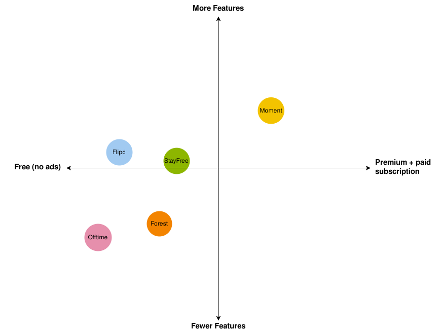

<!-- *********************************************************************** -->
<!--                                                                         -->
<!--                                                      :::      ::::::::  -->
<!-- README.md                                          :+:      :+:    :+:  -->
<!--                                                  +:+ +:+         +:+    -->
<!-- By: aperez-b <aperez-b@student.42.fr>          +#+  +:+       +#+       -->
<!--                                              +#+#+#+#+#+   +#+          -->
<!-- Created: 2023/05/18 11:49:02 by aperez-b          #+#    #+#            -->
<!-- Updated: 2023/05/18 12:46:42 by aperez-b         ###   ########.fr      -->
<!--                                                                         -->
<!-- *********************************************************************** -->

# Challenge 3: Are you ready to propose an innovative solution?

## Table of Contents

- [1. Planning](#1-planning)
- [2. Choice of Opportunity to Work](#2-choice-of-opportunity-to-work)
  - [Presentation of Opportunities](#presentation-of-opportunities)
  - [Decision Matrix and Selection of the Opportunity](#decision-matrix-and-selection-of-the-opportunity)
- [3. Analysis of the Competition](#3-analysis-of-the-competition)
  - [Identification of the Competition](#identification-of-the-competition)
  - [Determination of Key Parameters](#determination-of-key-parameters)
  - [Positioning Map](#positioning-map)
  - [Conclusions](#conclusions)
- [4. The Client/User](#4-the-client-user)
  - [Market Segmentation](#market-segmentation)
  - [User-Person](#user-person)
- [5. Ideation](#5-ideation)
  - [Generation of Ideas](#generation-of-ideas)
  - [Debate and Selection of Ideas](#debate-and-selection-of-ideas)
- [6. Prototyping and Testing](#6-prototyping-and-testing)

## 1. Planning

Here is my table of the planning of this activity:

| Activity | Due | Related and deliveable documents |
| :------: | :-: | :------------------------------: |
| 3. Task Scheduling | April 20th | Table 1. Activity Planning |
| 2.1. Presentation of opportunities | April 26th | - |
| 2.2. Decision matrix and selection of the opportunity | April 30th | Table: Decision matrix |
| 3.1. Identification of competition | May 1st | Table: Main competitors and comparison parameters (type B2C) |
| 3.2. Determination of key parameters | May 4th | Table: Main competitors and comparison parameters (type B2C) |
| 3.3. Positioning map | May 8th | Figure: Competition positioning map |
| 3.4. Conclusions | May 11th | Table: Conclusions of the analysis of the competition |
| 4.1. Market segmentation | May 12th | Table: Segmentation Parameter Analysis (B2C) Table: Segmentation customers/users |
| 4.2. User-person | May 13th | Table: Person User |
| 5.1. Generation of ideas | May 15th | Annex: List of ideas generated by each member |
| 5.2. Debate and selection of ideas | May 16th | Table: Innovative solution |
| 6.1. Prototype | May 17th | Annex: Prototype evidence |
| 7. Delivery of the CAE | May 18th | The Coordinator delivers a single document per group |

## 2. Choice of Opportunity to Work

### 2.1. Presentation of Opportunities

Here are the proposed opportunities:

1. A consulting firm that specializes in helping businesses create effective and ethical social media policies and practices.
1. A nonprofit organization that advocates for policies to regulate and limit the use of technology in certain environments including the workplace and schools.
1. A mobile app that uses machine learning algorithms to analyze users' social media usage patterns and provide personalized strategies for reducing screen time and increasing offline activities.

### 2.2. Decision Matrix and Selection of the Opportunity

| Opportunity | Evidence provided on problem and opportunity | Objective Market Dimension | Feasibility of proposal | Originality | Personal Preference | Total Points |
|:-----------:|:--------------------------------------------:|:-------------------------:|:-----------------------:|:-----------:|:-------------------:|:------------:|
| Consulting firm specialized in social media policies | 4 | 4 | 5 | 3 | 4 | **20** |
| Nonprofit organization advocating for tech regulation | 5 | 3 | 3 | 4 | 3 | **18** |
| Mobile app for reducing screen time | 5 | 4 | 4 | 4 | 5 | **22** |

Based on these scores, the mobile app is the best business opportunity

## 3. Analysis of the Competition

### 3.1. Identification of the Competition

Here are 4 potential competitors to the mobile app idea we have settled on:

Forest is a mobile application that makes not using a phone fun to encourage users to be more attentive and limit their screen time. The app encourages users to grow virtual trees away from their phones by rewarding them with points that can be used to plant actual trees.

Moment is a smartphone application that monitors how much time users spend using their phones and offers them individualized tips and direction to help them reduce screen time and enhance their digital health. Along with functions like daily limitations and reminders, the app includes tools to assist users in learning how to use their devices.

Flipd is a mobile app that enables users to disconnect from their devices and concentrate on activities that can be done offline. The app features lock screens and reminders to encourage users to put their phones away while also providing tools for setting and monitoring digital wellness goals.

Offtime is a flexible tool that helps users cut back on screen time and address their computer-related tendencies by blocking distracting websites and apps at specific times of day. The software includes functions like personalised timetables and notifications, as well as capabilities for studying and enhancing users' digital behaviors.

### 3.2. Determination of Key Parameters

| **Company**              | Moment                                                  | Forest                                                                                   | Flipd                                                                                    | Offtime                                                                                          |
| ------------------------|-------------------------------------------------------:|:---------------------------------------------------------------------------------------:|---------------------------------------------------------------------------------------:|-------------------------------------------------------------------------------------------------:|
| **Product or Service**   | Tracks screen time and app usage, provides coaching      | Encourages users to stay focused and off their phones by planting virtual trees          | Helps users unplug by locking them out of selected apps and services for a set time period | Tracks screen time and analyzes the data, provides actionable insights and restrictions          |
| **Price and Monetization Route** | Free (with in-app purchases) / Premium subscription | Freemium model                                                                     | Freemium model                                                                           | Free with ads / Freemium model                                                                      |
| **Positioning and Differentiation** | Coaching, supports mental health and wellbeing        | Gamification, promotes productivity and mindfulness                                      | App lockout feature, supports student success                                           | Actionable insights, enables digital detox                                                     |
| **Quality**              | High quality                                            | High quality                                                                             | High quality                                                                              | High quality                                                                                        |
| **Location**             | Global                                                  | Global                                                                                    | Global                                                                                     | Global                                                                                              |
| **Leadership**           | Experienced leadership team                             | Experienced CEO                                                                         | Experienced founder                                                                       | Experienced founder                                                                                 |
| **Clientele**            | General audience                                        | General audience                                                                        | Students and workers                                                                      | General audience                                                                                    |
| **Breadth of Products**  | Single product                                          | Single product                                                                           | Single product                                                                            | Single product                                                                                       |
| **Seniority / Experience** | Established                                             | Established                                                                              | Startup                                                                                   | Startup                                                                                             |
| **Dimension**            | Digital                                                 | Digital                                                                                  | Digital                                                                                    | Digital                                                                                             |
| **Geographical Scope**   | Global                                                  | Global                                                                                    | Global                                                                                     | Global                                                                                              |
| **Brands**               | N/A                                                     | N/A                                                                                       | N/A                                                                                        | N/A                                                                                                 |
| **Evolution / Trend**      | Profitable                                              | Profitable                                                                               | Not disclosed                                                                             | Not disclosed                                                                                       |

### 3.3. Positioning Map

### 3.4. Conclusions

The market for digital wellbeing and screen time apps offers chances for innovative products to stand out. These encompass features like social support, compatibility with other hardware and software, and more educational resources. Companies might concentrate on enhancing user experience to improve current ideas, whereas successful products frequently have strong leadership, provide genuine value, and have well defined monetization plans.

In general, this market is still developing, thus new developments are probably coming. Businesses can keep expanding and succeeding in this market by knowing the demands and priorities of their target audience.

## 4. The Client/User

### 4.1. Market Segmentation

4.1.1. It is B2C, because the app is designed to target individual users (consumers) rather than other businesses.
4.1.2. In this case, the customer (who pays) and the user (who uses/consumes) are the same profile, as individuals will be paying for and using the app themselves.

Here is the analysis of parameters of segmentation:

| SEGMENTATION B2C CRITERIA ANALYSIS | ANALYSIS: Who is your client? |
| :---: | :---: |
| Geographical | No specific limitations or considerations based on geography. |
| Demographics | Individuals of all genders, ages, marital statuses, family units, etc. may benefit from the app. |
| Socioeconomic | The app could potentially appeal to individuals of varying income levels and employment statuses, as long as they have access to a smartphone. |
| Cultural | The app would not be tailored to any specific cultural traditions, religions, or beliefs. |
| Lifestyle | The app targets individuals who are motivated to reduce their screen time and increase offline activities, and those who are concerned about the negative effects of excessive social media use. |
| Personality | The app does not specifically target any particular personality traits. |
| Decision process | The app is designed for personal use and its price sensitivity may vary depending on individual users' priorities and budgets. |
| Scope of use | The app is designed for personal use rather than professional use. |
| Benefits sought | The app prioritizes benefits such as reducing screen time, improving mental and physical health, and increasing offline activities. |
| Type of user | The app targets individuals who actively seek to reduce their social media usage, whether they are non-users, potential users, ex-users, sporadic users, usual users, or addicted users. |
| Brand loyalty | Brand loyalty is not a significant factor in this app's market segmentation. |

### 4.2. User-Person

Here is a sample User-Persona following the identified segments:

#### Personal Details

Name: Maya Patel
Age: 35
Gender: Female
Marital Status: Married with two children
Education: Master's degree in Business Administration

#### Context and Relationship to the Field or Problem

Maya is a busy working professional who spends most of her day sitting in front of a computer at work. She has noticed that she spends too much time on her phone, scrolling through social media apps like Instagram and Twitter during her free time. She feels guilty about not spending enough quality time with her family and wants to find ways to reduce her screen time so she can be more present with them.

#### Other Relevant Information

Maya and her family enjoy outdoor activities like hiking and camping.
She is interested in mindfulness practices but doesn't have much experience with them.
Maya uses an iPhone 12 and is comfortable using mobile apps.
She values family time and often plans activities to do together on weekends.

## 5. Ideation

### 5.1. Generation of Ideas

Here is a list of 10 possible ideas:

1. Create a gaming system that encourages users to spend less time on screens and more time doing offline activities.
1. Personalized activity recommendations based on the user's location, preferences, and past actions are provided.
1. Encourage users to cut back on their screen time by allowing social sharing of their accomplishments and progress.
1. To reward users who engage in offline activities, collaborate with neighborhood businesses to offer discounts on goods and services.
1. Send push notifications to users to remind them to take breaks and to suggest offline activities at particular times of the day or after a certain amount of screen time has passed.
1. Allow users to set objectives for minimizing screen time and boosting offline activities, and allow them to track their success over time.
1. Publish informational materials on the drawbacks of spending too much time on screens and the advantages of offline activities.
1. Reduce the amount of time users spend on screens by using machine learning algorithms to spot trends in their behavior.
1. Give consumers the chance to interact with people who are also attempting to cut back on their screen time and participate in offline activities with them.
1. To assist in reducing screen time, provide users the option to prohibit access to specific applications or websites at specified times.

### 5.2. Debate and Selection of Ideas

| Idea                                                     | Impact | Feasibility | Innovation | User Adoption | Cost | **Total** |
|:---------------------------------------------------------:|:------:|:-----------:|:----------:|:-------------:|:----:|:---------:|
| Implement a gamification system                           |   4    |      3      |     3      |       4       |   2  |     **16**     |
| Offer personalized suggestions for activities             |   4    |      4      |     3      |       4       |   3  |     **18**     |
| Use peer pressure to encourage users                      |   3    |      4      |     4      |       5       |   2  |     **18**     |
| Partner with local businesses                             |   3    |      3      |     4      |       4       |   4  |     **18**     |
| Send push notifications reminding users                   |   4    |      4      |     3      |       4       |   3  |     **18**     |
| Allow users to track their progress                       |   4    |      4      |     3      |       4       |   3  |     **18**     |
| Provide educational content                               |   3    |      4      |     4      |       5       |   2  |     **18**     |
| Utilize machine learning algorithms to identify patterns  |   5    |      4      |     5      |       4       |   4  |     **22**     |
| Enable users to connect with others                        |   3    |      3      |     4      |       3       |   3  |     **16**     |
| Offer a feature that allows users to block access         |   4    |      4      |     3      |       4       |   3  |     **18**     |

This ranking suggests that Idea 8 is the overall top choice. The fact that it received excellent marks for Impact, Innovation, and User Adoption suggests that it has the ability to solve the issue and enlist users. Although it is expected to cost a little more than some other concepts, it can nevertheless be implemented given available resources and technology, getting it a good overall grade.

## 6. Prototyping and Testing

Here is a general list of the various screens our app will cover.

### Screen 1: Sign-Up

Name, age, gender, and interests are entered by the user. Additionally, they give the app permission to access their social media data.

### Screen 2: Dashboard

The dashboard shows the user's daily screen usage as well as a list of personalized suggestions for cutting back on screen time and upping offline activities. Machine learning algorithms that examine the user's social media activity patterns produce the recommendations.

### Screen 3: Activity Suggestions

The user can browse a list of personalized activity recommendations based on their location, preferences, and previous behavior on this screen. Activities can also be filtered by category (for example, outdoor, indoor, sociable, or solo).

### Screen 4: Progress Tracking

The user's progress is displayed on this screen over time, along with their average daily screen time, the amount of offline activities they've finished, and their total progress toward their objectives.

### Screen 5: Settings

The user can change their notification preferences, location permissions, and activity preferences on this screen.

### Next Steps

We will conduct user testing with a target audience that closely resembles our ideal user profile to gauge the acceptance of this MVP. We will get feedback on the app's usability, the precision of the personalized recommendations, and how well it generally works to encourage users to spend more time offline and less time on screens. Before releasing the complete solution, we will refine the MVP and iterate based on the feedback.

May 18th, 20203
