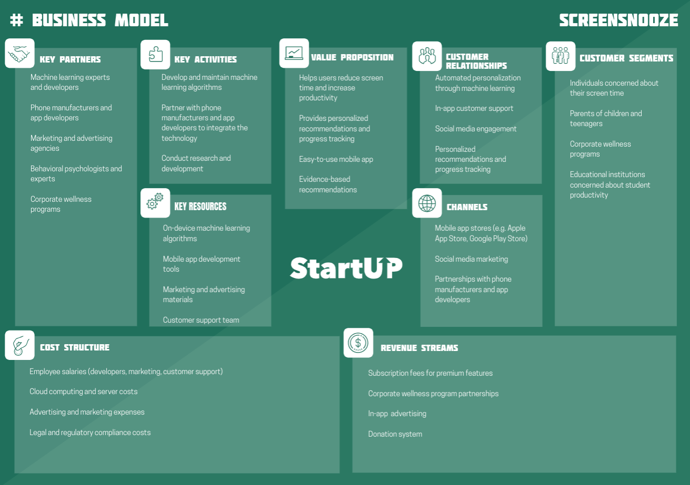
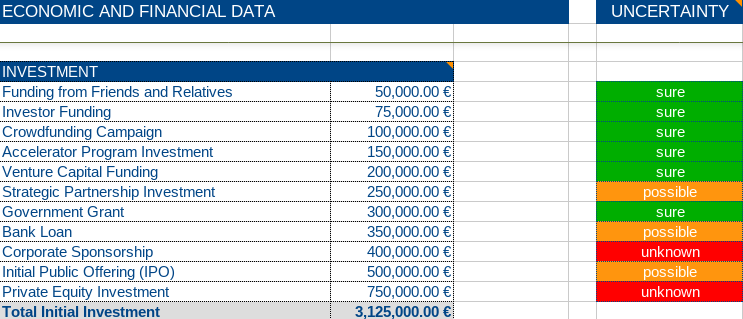
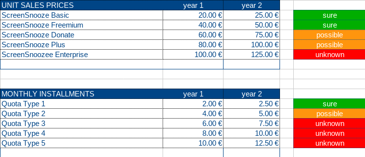
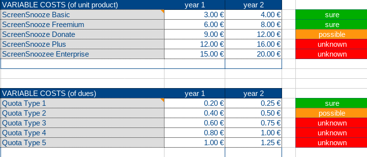
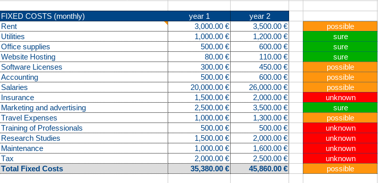
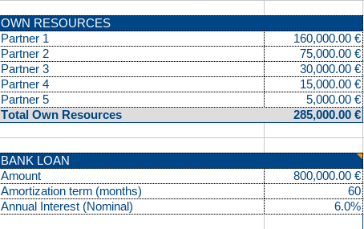
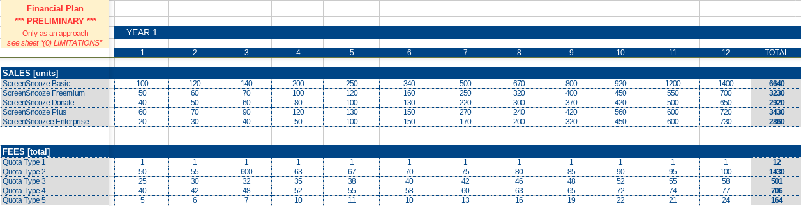
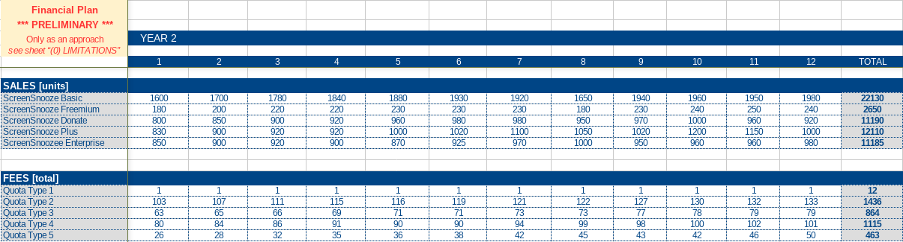
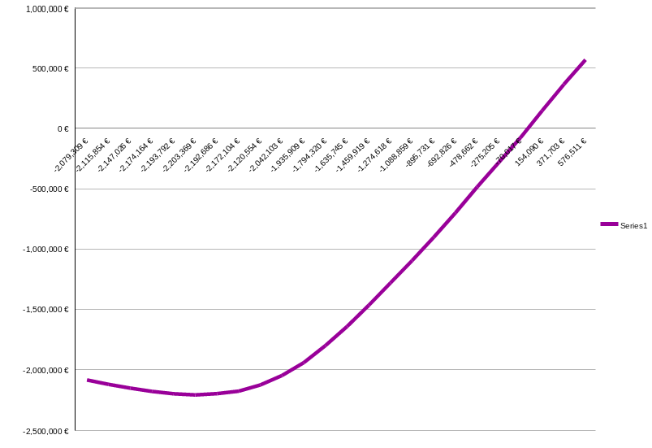

<!-- *********************************************************************** -->
<!--                                                                         -->
<!--                                         =@@*   +@@+                     -->
<!--                                         =@@*   +@@+ :*%@@@%*:           -->
<!--                                         =@@*   =@@+.@@@=--%@@-          -->
<!--                                         :@@%. .#@@--@@*   +@@* .+%@@@   -->
<!-- README.md                                =%@@@@@@+ =@@*   =@@+.@@@+-=   -->
<!--                                            .---:   -@@#.  *@@--@@*      -->
<!-- By: aperez-b <aperez-b@uoc.edu>                     +@@@@@@@* +@@+      -->
<!--                                                       :-==:.  -@@#      -->
<!-- Created: 2023/06/13 17:13:29 by aperez-b                       +@@@%@   -->
<!-- Updated: 2023/06/13 18:00:43 by aperez-b                                -->
<!--                                                                         -->
<!-- *********************************************************************** -->

# Challenge 4: Design a sustainable business model

## Table of Contents

- [Section I - Business Model](#section-i---business-model)
- [Section II - Agile Financial Plan](#section-ii---agile-financial-plan)
- [Section III - Funding the Project](#section-iii---funding-the-project)

## Section I - Business Model

Picking up on the business ideas from Challenge 3, we settled on the following idea:

```text
Reduce the amount of time users spend on screens by using machine learning
algorithms to recommend ways to stay off their phones
```

My business will be called ***ScreenSnooze***, a convenient play on words that
combines *screen* and *snooze*, as a way to identify the spirit of the app,
which is encouraging that people 'snooze' their devices.

Here is my Business Model Canvas based on Alexander Osterwalder's model:



## Section II - Agile Financial Plan

Using the given template, we have the following results:















With all this data, we get the following curve:



## Section III - Funding the Project

Regarding funding options, Venture capital is worth consideing.

In exchange for shares in the business, venture capital firms invest in start-ups with significant growth potential. Several advantages of this kind of finance for the project include:

- **Risk mitigation**: Before making an investment, venture capital firms often undergo a thorough due diligence process, which can help lower the risks involved with early-stage startups.
- **Contributing to growth**: In addition to cash, venture capital firms can offer contacts and strategic advice to support the project's expansion and success.
- **Increasing expansion speed**: With access to large capital, the initiative may expand more quickly, potentially reaching more users and bringing in more money.

June 13th, 2023
